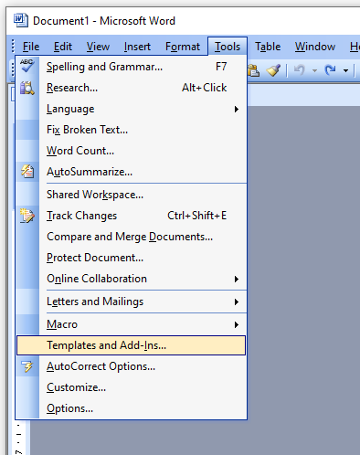
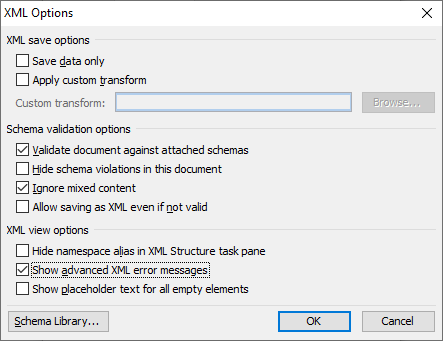
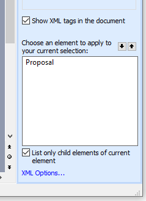
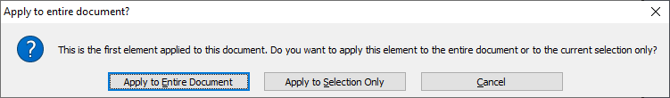
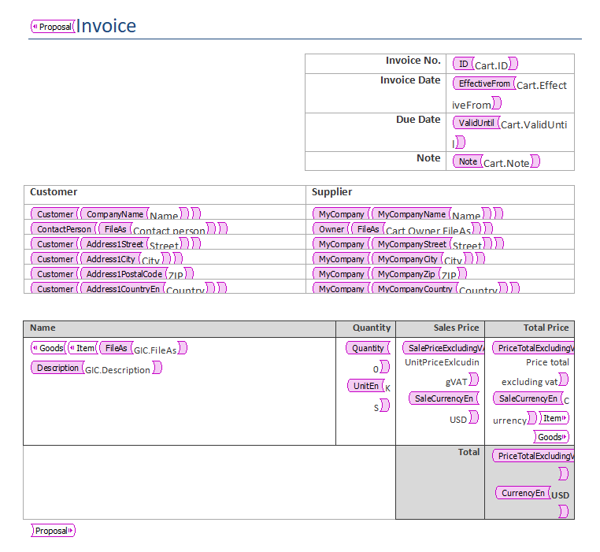
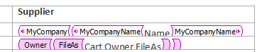
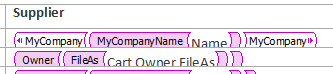
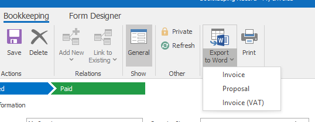

# WordprocessingML

## Prepare schema

Schema defines what eWay-CRM data will be available in the template. eWay-CRM exports all available data from the appropriate
items. If you have custom fields you will have to create custom schema and add required custom fields there.

See our schema for [Invoices](Templates/Invoice/Invoice.xsd).
If you for example have a custom field af_14 (your may use Alt + F1 shortcut on a control in eWay-CRM to get it's internal name) on Bookkeeping module, you may modify schema like this:

```xml
<xs:element name="Active" type="xs:string" minOccurs="0" />
<xs:element name="af_14" type="xs:string" minOccurs="0" />
<xs:element name="CreatedByGUID" type="xs:string" minOccurs="0" />
```

You should also modify schema namespace to some unique name. In this case we renamed Invoice to MyInvoice:

```xml
<?xml version="1.0" encoding="utf-8"?>
<xs:schema targetNamespace="urn:eway:document-schemas:MyInvoice"
    elementFormDefault="qualified"
    xmlns="urn:eway:document-schemas:Invoice"
    xmlns:xs="http://www.w3.org/2001/XMLSchema">
```

Root element of the schema is the item being exported. It contains all of it's attributes as child elements. Some child elements
represent other related items which also have own child elements. Common items are:
* **Owner** - User who owns the item being exported
* **CreatedBy** - User who created the item being exported
* **ModifiedBy** - User who modified the item being exported
* **SystemData**
  * **CurrentDate** - Date when the item was exported
  * **CurrentTime** - Time when the item was exported
  * **CurrentYear** - Year in that the item was exported
  * **CurrentMonth** - Month in that the item was exported
  * **CurrentDay** - Day in that the item was exported
  * **DefaultCurrency** - Default currency in ISO format
* **MyCompany** - Information about company from [global settings](https://kb.eway-crm.com/documentation/5-administration-application/5-7-global-settings/category-company-details/city-name-registration-number-street-vat-number-zip)
  * **MyCompanyCity**
  * **MyCompanyId**
  * **MyCompanyName**
  * **MyCompanyStreet**
  * **MyCompanyState**
  * **MyCompanyCountry**
  * **MyCompanyVatNumber**
  * **MyCompanyZip**

Based on exported item type, there are some additional elements available:
* **Bookkeeping** (Carts)
  * **Customer**
  * **ContactPerson**
  * **SuperiorItem**

* **Contacts**
  * **Company**

* **Deals** (Leads)
  * **Customer**
  * **ContactPerson**

* **Projects**
  * **Customer**
  * **ContactPerson**
  * **Supervisor**
  * **SuperiorProject**

Default schemas are available [here](Schemas/).

## Create template

Open Word 2003 and create a new empty document.

Go to **Tools** and click **Templates and Add-Ins...** and add the MyInvoice schema that was mentioned before.



In **XML Options** check these options:
* Validate document against attached schemas
* Ignore mixed content
* Show advanced XML error messages



After you add schema to the document, XML Structure panel will appear on the right:



Click on the element available (in this case Proposal) and apply it to the whole document:



In the document select text that you want to replace by data from eWay-CRM. In the right pane select the appropriate
element.



Make sure that elements that will be replaced by values are filled with color.



If it has white background move focus after the tag end (in this case MyCompanyName) and press space to fix the format. After the background color gets
applied you can remove the space.



## Publish template

As soon as the template is finished you have to publish it to eWay-CRM.

You need to generate SQL script that has to be executed against eWay-CRM server database. To generate the template
use our **Wml2Ew.exe** utility. See [transform.bat](Templates/Invoice/transform.bat) for Invoices.

**Wml2Ew.exe** has those parameters in the following order:
* Path to the template document
* XML Namespace from the schema (eg. urn:eway:document-schemas:MyInvoice)
* Name of the template that will be displayed in eWay-CRM
* [FolderName](https://github.com/eway-crm/php-lib/blob/master/FolderNames.md) in which will be the template available
  * **Carts**
  * **Companies**
  * **Contacts**
  * **Projects**
  * **Leads**
* Language in two letter format. Default is en.
  * **en**
  * **cs**
  * **de**
  * **ru**
  * **sk**
  * **no**
* Version of the template. Defaults to **2**.
* **1** to duplicate tempalte to other languages. Using this template will be available in eWay-CRM in all supported languages.

After you run the **Wml2Ew.exe** utility a SQL file will be created with the same name as name of the template document.

As soon as you execute the SQL script on the eWay-CRM server database users should be able to [see the template in eWay-CRM](https://kb.eway-crm.com/documentation/3-description/3-6-integration-with-microsoft-office/3-6-2-microsoft-word-and-excel/data-export-into-ms-word).

